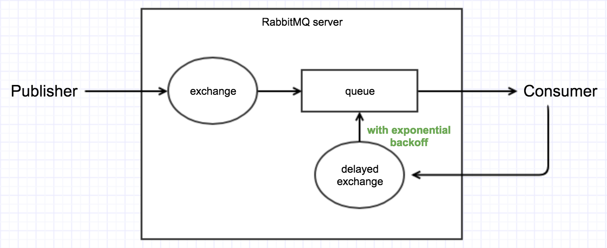
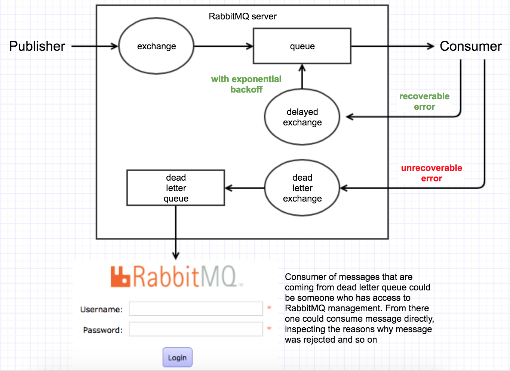

## Message acknowledgements

Message acknowledgement is mechanism provided to consumer application to inform RabbitMQ server about message handling results.
Consumer application (if in acknowledgement mode, `{noAck: true | false}`) can either send `ack`, `nack` or `reject` signals
back to broker.

1. `ack`, once sent from consumer application to broker will signal to broker that message was `successfully` processed.
It is up to consumer application to define what does it mean to `successfully` process the message. When broker
receives `ack` it will remove message from queue permanently.

2. `nack`, once sent from consumer application will signal to broker that message was **not** successfully processed.
By default, `nack` will put the message back in the queue **for later handling.** Here term **for later handling** is tricky
and will be explained above.

3. `reject`, the difference between `nack` and `reject` is in that broker will not requeue the message for later handling by default.
One could look on `nack` vs `reject` like `recoverable` errors and `unrecoverable` errors respectively. It is possible to declare
special type of exchange called `dead letter exchange` where all messagess will go if any of the following criteria:

- The message is rejected (basic.reject or basic.nack) with requeue=false,
- The TTL for the message expires; or
- The queue length limit is exceeded.

Here TTL for the message should not be confused with the time for which broker will wait for any type of acknowledgement from consumer application, because that time does not exists even if consumer needs very long time to send any type of acknowledgement. If consumer connection dies, broker will try to deliver message to next consumer if any, if next consumer does not exists it will redeliver the message when consumer reconnect.

### Messages that needs to be handled later (nack)
Imagine the use case in which your consumer application is communication with 3rd party service via HTTP which is currently down for `N` minutes. Depending on your logic this can be considered as `recoverable` error if you are receiving lets say `5xx` back. It would make sense to retry and handle message a little bit later expecting that 3rd party service next time will be up and running.

Running `consumer-problem.js` and `publisher.js` that can be found under `nack-problem-and-solution` folder yields following results:
```
[10/12/2017 19:20:59.769] [LOG]   Message received for the the 1 time
...
[10/12/2017 19:23:31.547] [LOG]   Message received for the the 246755 time
```

In two minutes broker requeue and delivered same message for `245 755` times. Probably not what you would expect nor probably you would want to handle recoverable errors in this manner. One solution to this problem is using some sort of expontential backoff strategy
(or whatever strategy you choose) with custom RabbitMQ plugin that can be found on: https://github.com/rabbitmq/rabbitmq-delayed-message-exchange

### Using delayed message exchange


Following test just mimics `success`, `recoverable` and `unrecoverable errors`. Consumer will generate new random number
between `1` and `10` on each message delivery, where if:
```
randomNumber = 1 => Success, consumer will do ACK
randomNumber = 2 => Unrecoverable errors, consumer will do REJECT
randomNumber from [3, 10] segment => Recoverable error, consumer will republish do delayed exchange
```

Now running `consumer-solution.js` and `publisher.js` under `nack-problem-and-solution` folder yields following results:
```
[11/12/2017 20:53:18.180] [LOG]   New message received
[11/12/2017 20:53:18.180] [LOG]   It was from [3, 10], consumer will try to handle message again
[11/12/2017 20:53:20.182] [LOG]   New message received
[11/12/2017 20:53:20.182] [LOG]   It was from [3, 10], consumer will try to handle message again
[11/12/2017 20:53:22.185] [LOG]   New message received
[11/12/2017 20:53:22.185] [LOG]   It was 1 consumer successfully processed message, acking...
```
If we would translate this to more realistic scenario, it is like consumer application for the first two times received
`5xx` from 3rd party service, but third time it was `200`. This example is using constant retry strategy where message will
be republished every 2 seconds to delayed exchange. There are many ways to improve example, such as defining maximum number
of times that same message can be handled again. If you reach maximum number you could reject the message. Besides that you could use exponential backoff strategy and republish the message every 2, 4, 8, 16, ... seconds. Example is using `fanout` as an type for
delayed exchange, but in more complex system it would be better to use `direct` type when more than one queue exists. In that case you
could bind queue with delayed exchange where `bindingKey` would be equal to queue name. That is just one way of handling that.

### Complete picture with dead lettter exchange in place


## Delivery guarantee

### Mandatory flag and pubisher confirms
1. transient (non persistent) message is confirmed (Acked) the moment it is enqueued</span>
```
[20/11/2017 13:44:37.800] [LOG]   Consumer connected, awaiting for messages
[20/11/2017 13:44:45.229] [LOG]   Publisher connected
[20/11/2017 13:44:45.230] [LOG]   Publisher about to publish message
* [20/11/2017 13:44:45.233] [LOG]   Message acked on publisher side
* [20/11/2017 13:44:45.234] [LOG]   Consumer received message, working...
[20/11/2017 13:44:50.236] [LOG]   Consumer processed message
```
2. An `un-routable` mandatory message is confirmed right after the `basic.return`

From publisher perspective while using `publishier confirms` this one gets tricky.

In case of un-routable message (not mandatory) message publisher can't know about positive/negative outcome.
Positive outcome would be that message is `enqueued`, while negative one would be that message is `un-routable`.
In both case publisher will receive same info about message being acked, but consumer received nothing.
```
[30/11/2017 12:55:45.957] [LOG]   Consumer connected, awaiting for messages
[30/11/2017 12:55:52.090] [LOG]   Publisher connected
[30/11/2017 12:55:52.091] [LOG]   Publisher about to publish message
[30/11/2017 12:55:52.094] [LOG]   Message acked on publisher side
```

So rabbitmq will **silently** drop this message, while publisher could think that everything went well.
Solution to this is to use `mandatory` flag while publishing and to listen to `return` event on channel.
> The mandatory flag is an argument that is passed along with the Basic.Publish RPC command and tells RabbitMQ that if a message is not routable, it should send the message back to the publisher via a Basic.Return [RabbitMQ in Depth]
```
channel.on('return', (message) => console.error('Message returned back to publisher', message))
channel.publish(config.EX.name, routingKey, content, {mandatory: true}, onConfirmation)
```

```
[30/11/2017 13:07:55.204] [LOG]   Consumer connected, awaiting for messages
[30/11/2017 13:07:58.929] [LOG]   Publisher connected
[30/11/2017 13:07:58.930] [LOG]   Publisher about to publish message
[30/11/2017 13:07:58.933] [ERROR] Message returned back to publisher {
  fields: {
     replyCode: 312,
     replyText: 'NO_ROUTE',
     exchange: 'company.e.whatever-exchange',
     routingKey: 'whatever.b.b'
   },
   properties: {
     contentType: undefined,
     contentEncoding: undefined,
     headers: {},
     deliveryMode: undefined,
     priority: undefined,
     correlationId: undefined,
     replyTo: undefined,
     expiration: undefined,
     messageId: undefined,
     timestamp: undefined,
     type: undefined,
     userId: undefined,
     appId: undefined,
     clusterId: undefined
   },
   content: <Buffer 74 65 73 74>
}
[30/11/2017 13:07:58.935] [LOG]   Message acked on publisher side
```

3. Persistent message is confirmed when it is persisted to disk or when it is enqueued**

Only the first causes a confirm to be sent. Every published message will be confirmed sooner or later and no message will be confirmed more than once

### Alternate exchanges
Dedicated exchange where un-routable message will go.

```
[01/12/2017 14:21:06.503] [LOG]   Consumer connected, awaiting for messages
[01/12/2017 14:21:15.171] [LOG]   Publisher connected
[01/12/2017 14:21:15.172] [LOG]   Publisher about to publish message
[01/12/2017 14:21:15.175] [LOG]   Unroutable message received test
```

Now when publishing with `mandatory: true`, `Basic.Return` wont be issued to publisher. So registering event handler for `return` on given channel will never be fired. Dedicated consumer will receive un-routable message.

### Highly available queues (redundant copies)
This implies that you have cluster of RabbitMQ servers. By default even if you have one, queue exists at only one server, where it was firstly declared. This works by passing `policy` when queue is about to be declared. Policy will tell where your mirrored(slaves) queues
will be declared. Messages published to the queue are replicated to all mirrors. Consumers are connected to the master regardless of which node they connect to, with mirrors dropping messages that have been acknowledged at the master. If node where master is goes down, next master is oldest mirror.

## TCP Backpressure
https://github.com/squaremo/amqp.node/issues/365
